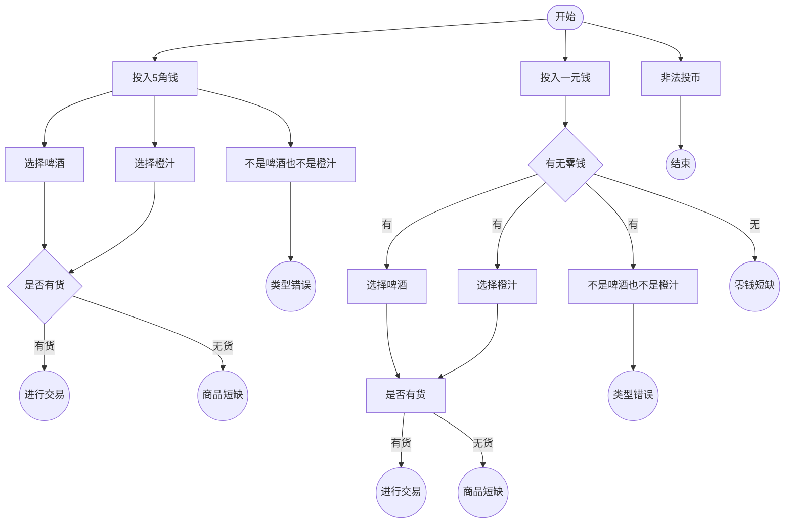

```mermaid
graph TD

start([开始]) --> A[投入5角钱] 
A --> B[选择啤酒] 
B --> C{是否有货}
C --有货--> end1((进行交易))
C --无货--> end2((商品短缺))
A --> D[选择橙汁]
D --> C{是否有货}
A --> E[不是啤酒也不是橙汁] --> end3((类型错误))
start([开始]) --> F[投入一元钱] 
F --> G{有无零钱}
G --有--> H[选择啤酒]
H --> I[是否有货]
I --有货--> end4((进行交易))
G --有--> J[选择橙汁]
J --> I
I --无货--> end5((商品短缺))
G --有--> K[不是啤酒也不是橙汁]
K --> end6((类型错误))
G --无-->end7((零钱短缺))
start --> L[非法投币] --> end8((结束))
```

